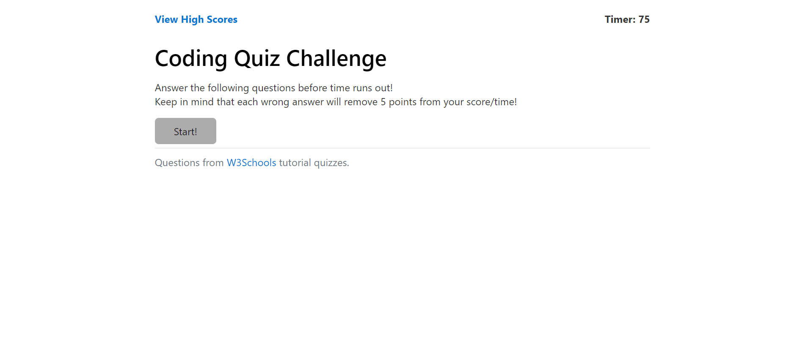
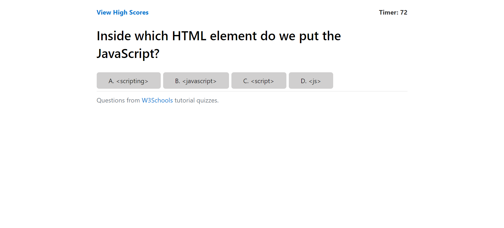
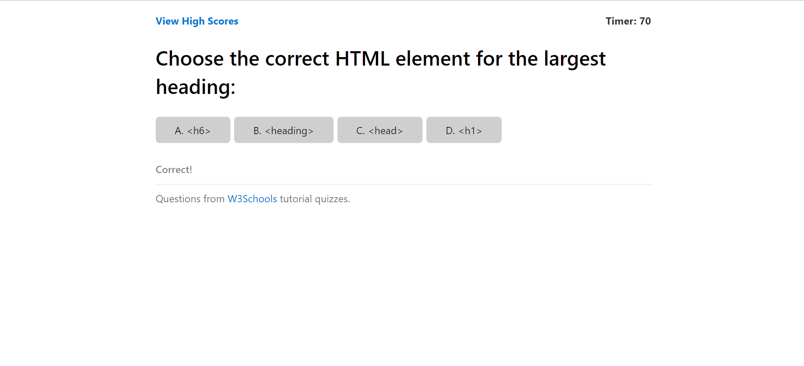
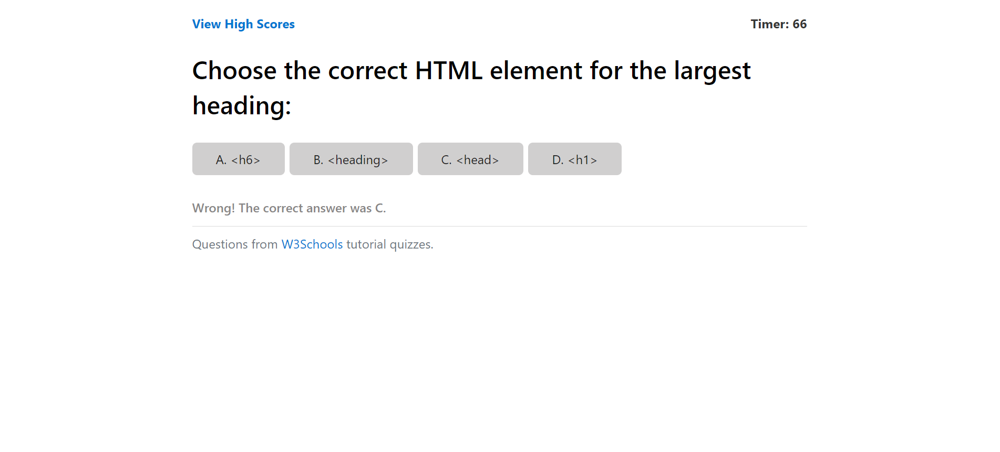
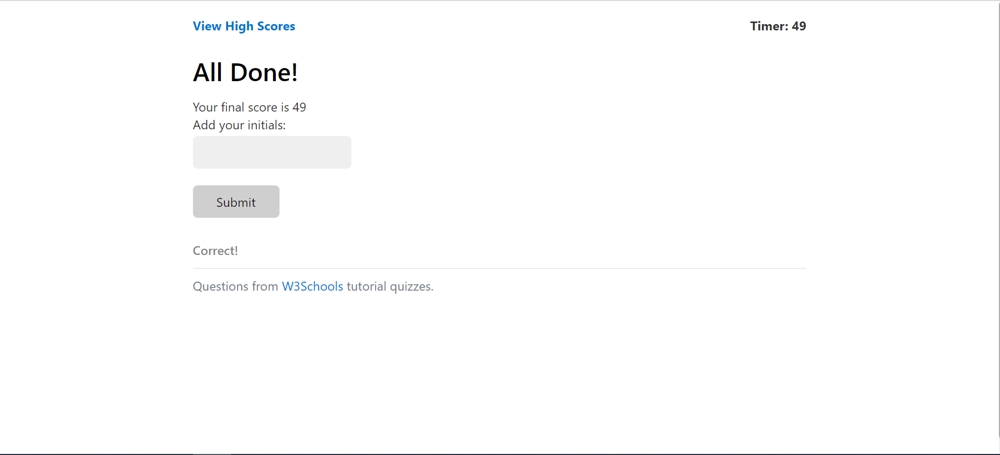
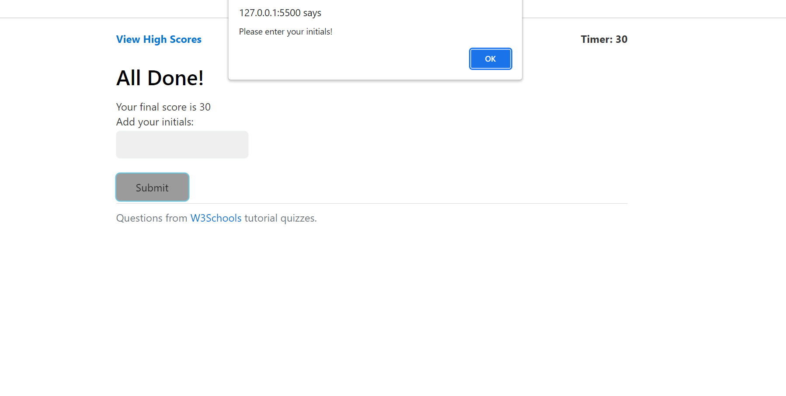
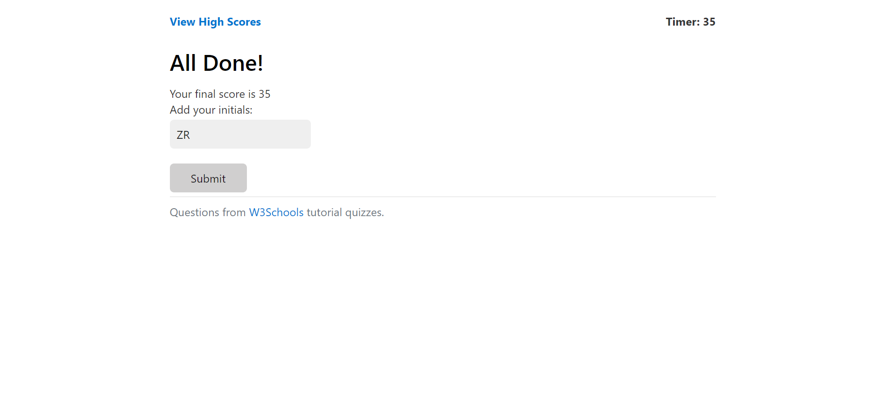
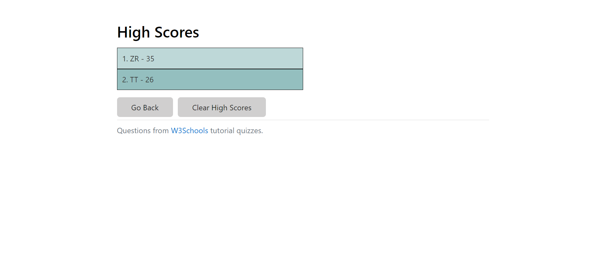

# Coding Quiz Challenge
[Link to My Project](https://zoerorvig.github.io/code-quiz/)

## Table of Contents
- [Description](#description)
- [Visuals](#visuals)

## Description 
This webpage presents a timed coding quiz that deducts points for wrong answers and allows the user to save their initials/scores to the High Scores board.

Features Include:
- A title page that includes a link directly to the High Scores page, the initial timer, description of the challenge, and a start button.
- Ten coding questions on HTML, CSS, and JavaScript. 
- A working timer (75 seconds) that subtracts five seconds when a question is answered incorrectly.
- Immediate feedback on the previous question. 
- Completion/game over page that shows the users final score and a place to enter initials. 
- Alert if submit button is clicked without entering initials 
- High Scores page featuring stored high scores, a "Go Back" button, and "Clear High Scores" button.
- "Go Back" button will send the user back to the title page where they can retake the quiz.
- "Clear High Scores" button will clear all the scores in Local Storage. 
- Footer with reference to the site used for the questions and a link for more quizzes. 

## Visuals 

The following is a screenshot of the title page:

The following screenshot is an example of a question:

The following screenshot is an example of a correct answer:

The following screenshot is an example of a wrong answer:

The following is a screenshot of the completion/game over page:

The following is a screenshot of the alert when no initials are submitted:

The following is a screenshot of the initials on the completion page:

The following is a screenshot of the High Scores page:

